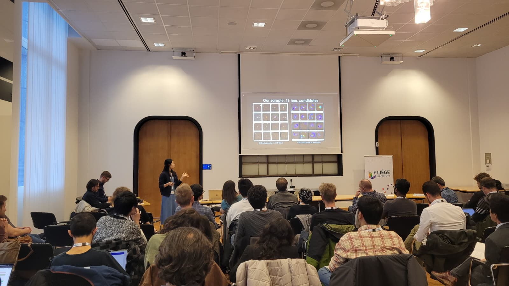
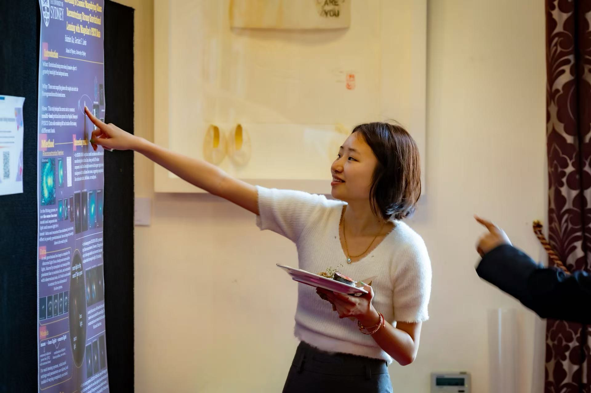



Hobbies
======

Outside of research, I enjoy photography, bouldering, and playing badminton.
Here are some moments from my work and life.

<!-- 第一行：group photo和conference photo -->

  
  

  <!-- 第一行和第二行间隔 -->

<!-- 第二行：左一右二 -->

 <!-- 设置总高度 -->
  <!-- 左边第一张 -->
  

    
  

  <!-- 右边第二、第三张 -->
  

    
    
  

  <!-- 第二行和第三行间隔 -->

<!-- 第三行：第四、第五张照片 -->

  
  

