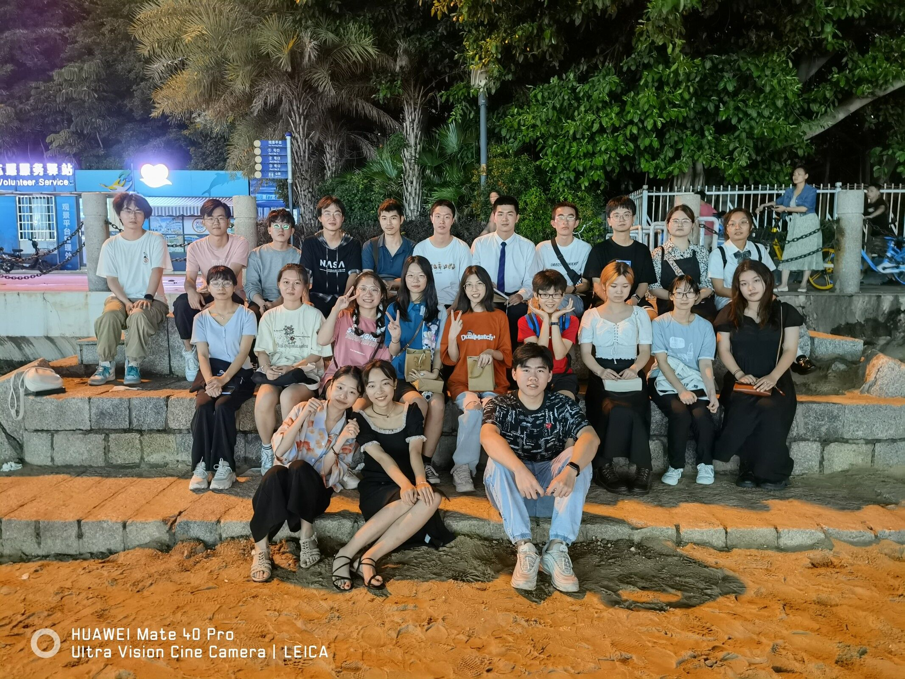



* Recently, I was reading the book [River Town](../assets/River Town (Two Years on the Yangtze) by Peter Hessler.pdf). It's about the city, Fuling, which is also near my hometown, Chongqing.

* The life is complicated and varied. I enjoy picking some cherished parts, just like the white cubes in the game, Rusty Lake, and editing them to produce vedios, uploaded on [my bilibili website: https://space.bilibili.com/62263703](https://space.bilibili.com/62263703). 
* In my college, I have joined a lovely group and met amazing friends:

======
* This is Scientific Technology and Innovation Center (STIC) at College of Physics, at Xiamen University!
 We are the STIC people!

======
 我爱你，请再见！I love you, Goodbye! 

---

* Welcome new 'children' to our family:

* Movies for idealist
======

======
* Always hold the wish to impact others positively. 
